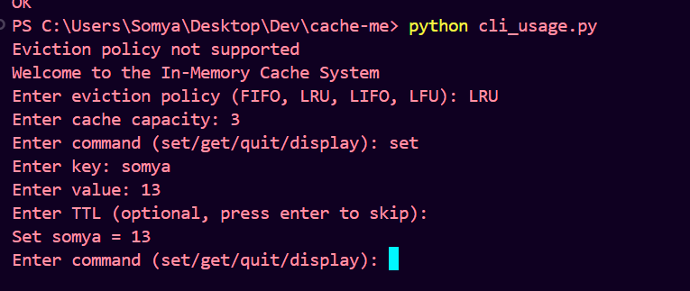
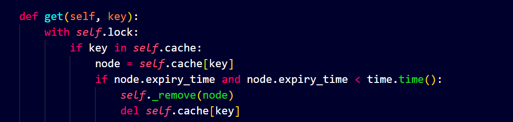
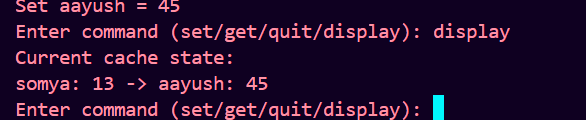
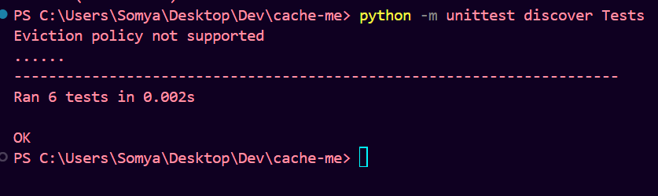

# Cache Library

The Cache Library is a general purpose caching tool that provides an in-memory caching solution with support for multiple eviction policies, custom eviction policies, thread safety, and unit tests.

## Features

- **Multiple Eviction Policies**:
 Supports FIFO, LRU, LIFO, and LFU eviction policies.


- **Custom Eviction Policies**: Easily add and use custom eviction policies.

- **Thread Safety**: Implemented with thread-safe operations using locks.


- **Display current state**: Visualize the current state of the cache


- **Unit Tests**: Includes comprehensive unit tests for different eviction policies.


## To run the project locally

```
git clone https://github.com/coderSomya/Cache-me.git
```

```
cd Cache-me
```

## To use the cache via cli

```
python cli_usage.py
```

## To run tests

```
python -m unittest discover Tests
```